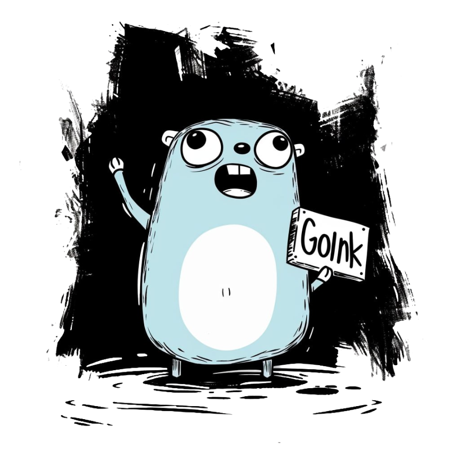

<h1 align="center">GoInk</h1>

    </img>

    </img>
    
    </img>

## Introduction

This project is based on the following open source libraries:

- [Gin](https://github.com/gin-gonic/gin)
- [swaggo](https://github.com/swaggo/swag)
- [zap](https://github.com/uber-go/zap)
- [lumberjack](https://github.com/natefinch/lumberjack)
- [golang-jwt](https://github.com/golang-jwt/jwt)

It' s used to quickly build a web server with mainstream infrastructure to provide an environment for quickly developing API routes, middleware, and database operations, and to save the time of file hierarchy planning and log customization.

## License

[MIT](./LICENSE.md)
